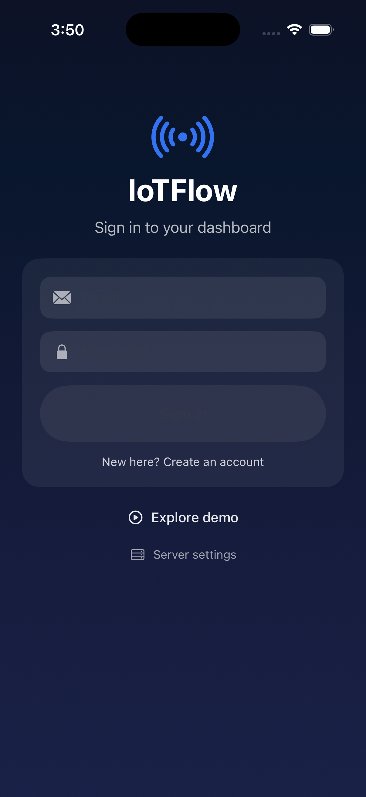
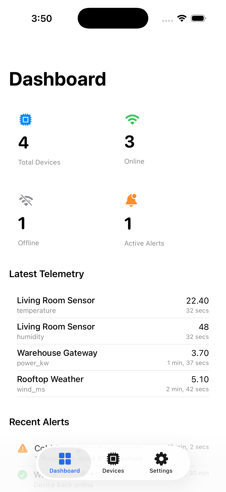
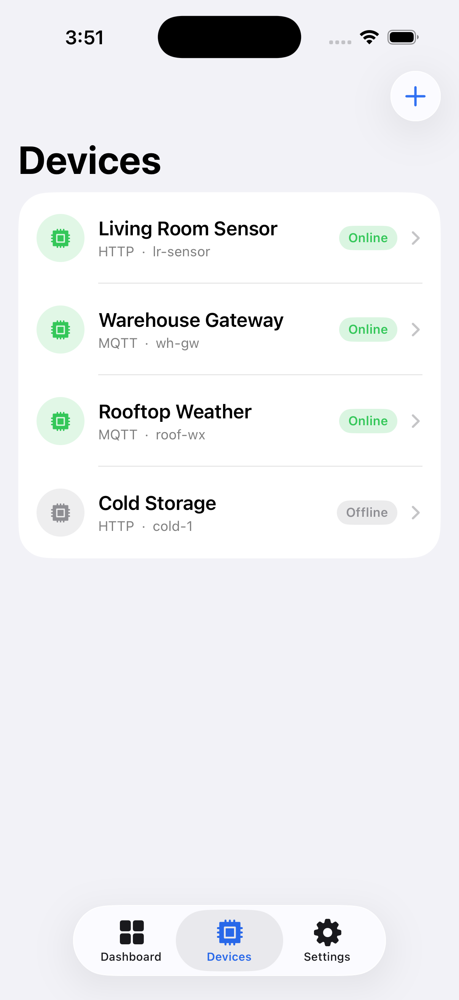
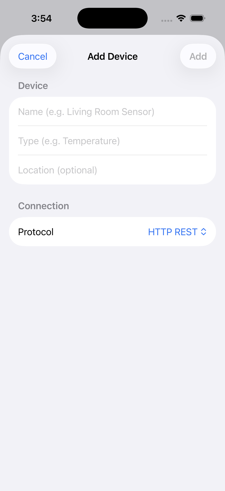
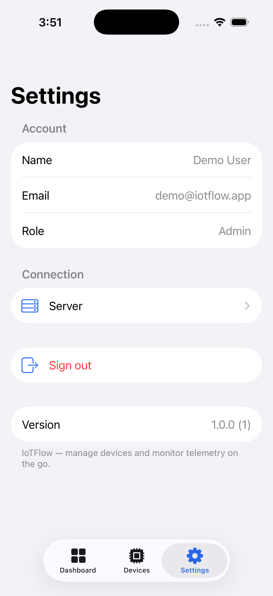

# IoTFlow iOS

A native **SwiftUI** iOS client for the [IoTFlow](https://iot.tertiaryinfotech.com/) self‑hosted IoT platform ([backend repo](https://github.com/alfredang/iotplatform)). Add devices, monitor live telemetry, and keep an eye on alerts — from your iPhone.

<p align="center">
  
  
  
  
</p>


## Features

- 🔐 **Sign in / register** against the IoTFlow backend (Auth.js credentials, cookie session).
- 📊 **Dashboard** — total / online / offline device counts, active alerts, latest telemetry and recent alerts, with pull‑to‑refresh.
- 🧩 **Devices** — browse all your devices with live online/offline status, view per‑device detail (protocol, telemetry count, last seen, location), and swipe to delete.
- ➕ **Add a device** — name, type, location and protocol (HTTP / MQTT / WebSocket); the generated device token is shown once and copyable for flashing onto ESP32 / Arduino / Raspberry Pi.
- ⚙️ **Settings** — account info, configurable server URL (point at any self‑hosted IoTFlow instance), and sign out.
- ▶️ **Demo mode** — explore the full UI with sample data without a backend.

## Screenshots

| Sign in | Dashboard | Devices | Add device | Settings |
|---|---|---|---|---|
|  |  |  |  |  |

## Tech stack & skills

| Area | Technology |
|---|---|
| Language | Swift 5 |
| UI | SwiftUI (declarative, `@StateObject` / `@EnvironmentObject` state) |
| Concurrency | Swift `async/await`, `actor`‑isolated networking |
| Networking | `URLSession` + `HTTPCookieStorage` (NextAuth CSRF + credentials flow) |
| Architecture | MVVM‑ish: `APIClient` (actor) · `SessionStore` (observable) · SwiftUI views |
| Persistence | `UserDefaults` (server URL, session cookie) |
| Project gen | [XcodeGen](https://github.com/yonaskolb/XcodeGen) (`project.yml`) |
| Min target | iOS 17 |

**Demonstrated skills:** SwiftUI app architecture · async networking against a Next.js/Auth.js API · cookie‑based session auth on a native client · Codable models with custom ISO‑8601 date decoding · reusable component design · App Store build, signing & archive workflow.

## Backend API

The app talks to the IoTFlow REST API:

| Endpoint | Use |
|---|---|
| `GET /api/auth/csrf` + `POST /api/auth/callback/credentials` | Sign in (Auth.js) |
| `POST /api/auth/register` | Create account |
| `GET /api/auth/session` | Restore session |
| `GET /api/dashboard/summary` | Dashboard counts, telemetry, alerts |
| `GET /api/devices` · `POST /api/devices` · `DELETE /api/devices/:id` | List / add / remove devices |

## Getting started

```bash
# 1. Install the project generator (once)
brew install xcodegen

# 2. Generate the Xcode project from project.yml
xcodegen generate

# 3. Open and run
open IoTFlow.xcodeproj
```

Set your team in **Signing & Capabilities** (or build from the CLI):

```bash
xcodebuild -project IoTFlow.xcodeproj -scheme IoTFlow \
  -destination 'platform=iOS Simulator,name=iPhone 17 Pro' build
```

By default the app points at `https://iot.tertiaryinfotech.com`. Change it any time under **Settings → Server**, or tap **Explore demo** on the sign‑in screen to try it with sample data.

## Project structure

```
IoTFlow/
├── IoTFlowApp.swift        # App entry
├── APIClient.swift         # Actor-isolated networking layer
├── SessionStore.swift      # Auth state (ObservableObject)
├── Models.swift            # Codable models
├── DemoData.swift          # Sample data for demo mode
├── Views/
│   ├── RootView.swift      # Auth gate + tab bar
│   ├── LoginView.swift
│   ├── DashboardView.swift
│   ├── DevicesView.swift
│   ├── AddDeviceView.swift
│   ├── DeviceDetailView.swift
│   └── SettingsView.swift
└── Assets.xcassets         # App icon + accent color
project.yml                 # XcodeGen spec
```

## Acknowledgements

- [IoTFlow platform](https://github.com/alfredang/iotplatform) — the self‑hosted backend this app connects to.
- Built with SwiftUI and [XcodeGen](https://github.com/yonaskolb/XcodeGen).

## License

MIT © Alfred Ang
